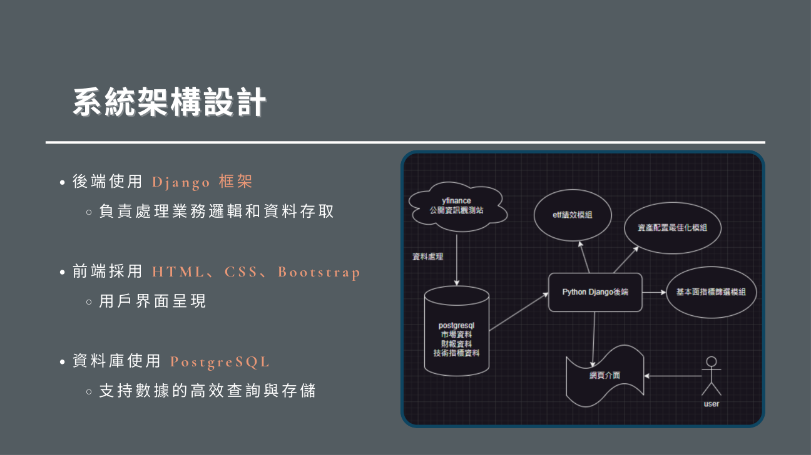
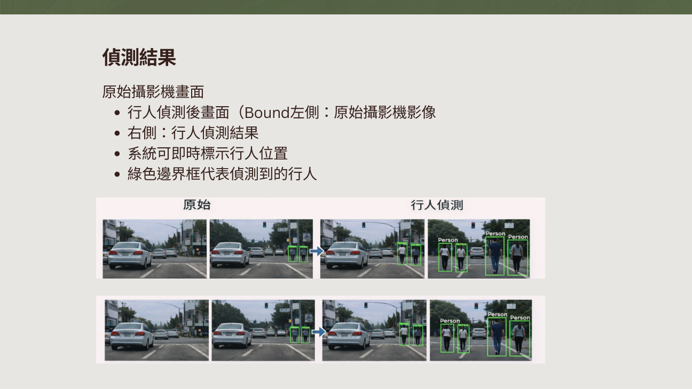
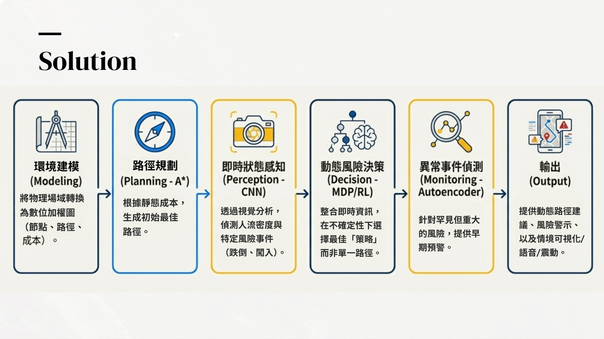
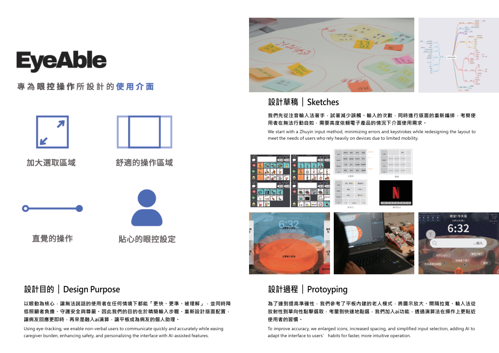

# 楊善茵｜軟體與演算法研發作品集

[Email](mailto:junkookyinyin@gmail.com) · [履歷 PDF](resume/resume.pdf) · [證照與獲獎](credentials/README.md) · [完整修課](education.md)

## 關於我

我是楊善茵，具東吳大學資料科學系學士（2021–2025）與碩士（2025–2026）學歷，求職方向為軟體與演算法研發。具 Python 實作經驗，專案涵蓋網站與資料庫整合、電腦視覺、資料管線及機器學習模型，能將問題拆解為資料處理、功能實作與結果驗證等步驟。

大學畢業專題參與「投資指南針」團隊開發，接觸 Django、PostgreSQL 與 Azure 部署；個人課程實作則以 OpenCV 串接 YOLO 預訓練模型完成行人偵測，並在 Ubuntu 環境操作 Airflow、NiFi 等工具。這些經驗讓我從模型研究延伸到程式、資料庫與系統流程的整合。

碩士論文以 260,864 筆電商樣本與 32 項特徵比較資料平衡及生成模型方法，另以不同預測目標進行台股模型研究與滾動回測。我也參與 AI CUP、智慧照護跨域工作營，並在人工智慧課程提出視障友善導引方案，累積模型驗證、需求分析與團隊合作經驗；期待在工程師工作中深化軟體開發、除錯與系統整合能力。

## 學歷

- **2025–2026**｜東吳大學 資料科學系 碩士
- **2021–2025**｜東吳大學 資料科學系 學士

## 技術能力與 ATS 關鍵字

- **程式與應用**：Python、OpenCV、YOLO 預訓練模型；團隊專題使用 Django、HTML、CSS、Bootstrap。
- **資料庫與系統**：PostgreSQL、SQL、Ubuntu；課程實作 Airflow、NiFi、Elasticsearch、Kibana；團隊專題使用 Azure VM、crontab。
- **模型與驗證**：CGAN、XGBoost、VMD、特徵工程、交叉驗證、滾動回測；團隊競賽使用 LightGBM、Random Forest、FFT、小波。
- **人工智慧課程提案方法**：A*、CNN、MDP、Reinforcement Learning、Autoencoder；屬架構發想，與已完成實作區分。

## 專案導覽

| 專案 | 性質 | 內容重點 |
| --- | --- | --- |
| [投資指南針](projects/investment-compass/README.md) | 大學畢業專題｜團隊開發 | 26 張資料表 · 網站、資料管線與雲端部署 |
| [天貓顧客回購預測](projects/tmall-repurchase/README.md) | 碩士學位論文 | 260,864 筆樣本 · 32 項特徵 |
| [基於 YOLO 的即時行人偵測系統](projects/yolo-pedestrian/README.md) | 多媒體資料檢索與處理｜課程實作 | 攝影機影像輸入 · Person 類別辨識與框選 |
| [視障友善智慧導引與安全系統](projects/accessible-navigation/README.md) | 人工智慧｜系統發想與架構提案 | 路徑規劃、環境感知、決策與異常預警整合構想 |
| [資料工程環境與管線實作](projects/data-pipeline-lab/README.md) | 資料工程｜期中課程作業 | 39 頁實作紀錄 · 環境建置、資料讀寫與工具串接 |
| [AI CUP 2025 智慧球拍辨識](projects/ai-cup-2025/README.md) | 春季賽 · 團隊參與 | 4 項分類任務 · 200+ 候選特徵 |
| [台股預測與策略回測](projects/vmd-msanet/README.md) | VMD-MSANet · 聯發科 2454.TW | 16 個 VMD 特徵 · 單日與五日預測方法比較 |
| [EyeAble 智慧眼控介面](projects/eyeable/README.md) | USR 跨域工作營 · 第四組 | 金秀獎 · 54 小時工作營 |
| [模擬投資競賽](projects/investment-competition/README.md) | 金融計算與智能交易 · 2026/03–06 | 第 2 名 · 模擬報酬 29.56% |

## 成果預覽

### 投資指南針

### 基於 YOLO 的即時行人偵測系統

### 視障友善智慧導引與安全系統

### EyeAble 智慧眼控介面

## 證照與獲獎

依日期由新到舊排列。

- **2026/09/16｜Google Analytics（分析）個人認證**：依原證書名稱列示（原圖標示 UA）。
- **2026/06/12｜模擬投資競賽 第 2 名**：金融計算與智能交易；模擬報酬 29.56460%。
- **2025/11/19｜EyeAble 團隊金秀獎**：實踐大學 USR 智慧照護設計，第四組。
- **2025/11/02｜智慧照護設計工作營 54 小時**：依工作營參與證日期列示。
- **2022/02/24｜金融市場常識與職業道德測驗合格**：2022/03/01 發證；證載有效至 2027/02/23。

## 閱讀與重現

各專案頁列出問題、方法、功能、成果與限制。團隊實作、個人課程實作、研究回測及系統提案分別標示。原始專案碼尚未提供；作品集不把提案或報告冒充可執行產品。

[更新此 GitHub 作品集的步驟](UPDATE_GUIDE.md)
