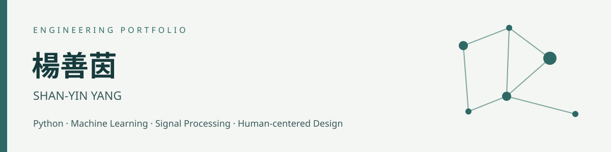

**軟體研發 · 演算法應用 · 智慧照護跨域設計**

[Email](mailto:junkookyinyin@gmail.com) · [履歷 PDF](resume/resume.pdf) · [證照與獲獎](credentials/README.md)

## 關於我

東吳大學資料科學系學士、碩士畢業，求職方向為軟體與演算法研發。具 Python 模型開發經驗，專案涵蓋電商生成模型、運動感測訊號與金融時間序列，並參與智慧照護跨域設計。重視問題拆解、特徵建構與模型驗證，也透過團隊合作理解技術與使用需求之間的連結。

## 精選成果

| 研究與實作 | 競賽與跨域 |
| :--- | :--- |
| **260,864 筆**天貓分類樣本、**32 項**模型特徵 | **EyeAble 金秀獎**、54 小時智慧照護工作營 |
| AI CUP **4 項分類任務**、團隊 **200+ 候選特徵** | 模擬投資競賽 **第 2 名**、模擬報酬 **29.56%** |

## 專案導覽

| 專案 | 主題與技術 | 身分與成果 |
| :--- | :--- | :--- |
| [天貓顧客回購預測](projects/tmall-repurchase.md) | CGAN / XGBoost / ROS / SMOTE / ADASYN | 碩士學位論文；260,864 筆樣本 · 32 項特徵 |
| [AI CUP 2025 智慧球拍辨識](projects/ai-cup-2025.md) | FFT / Wavelet / XGBoost / LightGBM / Random Forest | 春季賽 · 團隊參與；4 項分類任務 · 200+ 候選特徵 |
| [台股預測與策略回測](projects/vmd-msanet.md) | Python / yfinance / vmdpy / Attention / Multi-task Learning | VMD-MSANet · 聯發科 2454.TW；16 個 VMD 特徵 · V2 / V3 迭代 |
| [EyeAble 智慧眼控介面](projects/eyeable.md) | Accessibility / UX / Eye-tracking Interface / iPadOS | USR 跨域工作營 · 第四組；金秀獎 · 54 小時工作營 |
| [模擬投資競賽](projects/investment-competition.md) | Portfolio Review / Risk Management / Performance Tracking | 金融計算與智能交易 · 2026/03–06；第 2 名 · 模擬報酬 29.56% |

## 技術能力

- **程式與資料流程**：Python、yfinance、vmdpy、資料前處理、特徵工程、時間序列對齊。
- **模型研究**：CGAN、XGBoost、不平衡資料處理、VMD、注意力機制、雙任務學習。
- **競賽團隊使用技術**：LightGBM、Random Forest、Gradient Boosting、FFT、db4 小波、Mutual Information、soft voting。
- **評估方法**：3-fold 交叉驗證、驗證集門檻搜尋、逐日滾動回測、基準比較。
- **跨域經驗**：智慧照護需求討論、無障礙介面設計、成果海報與專刊展示。

## 學歷

- 東吳大學 資料科學系 碩士
- 東吳大學 資料科學系 學士

[完整修課背景](education.md)

## 證照與獲獎

- **2025/11｜EyeAble 團隊 金秀獎** — 實踐大學 USR 智慧照護設計成果。
- **2025/11｜智慧照護設計工作營** — 完成 54 小時。
- **2026/06｜模擬投資競賽 第 2 名** — 金融計算與智能交易課程。
- **2026/09｜Google Analytics（分析）個人認證** — 依提供之證書名稱列示。
- **2022/02｜金融市場常識與職業道德測驗合格** — 證書載明有效至 2027/02/23。

## 作品集範圍

這是研究與成果展示型作品集。目前收錄專案說明、履歷與部分佐證，尚未附訓練程式、原始資料或模型權重。各專案已分別說明個人研究、團隊參與、模擬交易與設計構想，避免混淆成果性質。

聯絡：[junkookyinyin@gmail.com](mailto:junkookyinyin@gmail.com)
